# inicio
 
Criação e inserção de dados.
---

- Criando a tabelinha
```bash
CREATE TABLE livros(
    id SERIAL PRIMARY KEY,
    nome VARCHAR(70) NOT NULL,
    autor VARCHAR(40) NOT NULL,
    preco DECIMAL(10,2) NOT NULL,
    genero VARCHAR(30) NOT NULL,
    estoque INTEGER NOT NULL,
    ano_publicacao NUMERIC NOT NULL
)
```
---

#Bloco 1
 
Reconhecimento da base

- mostrando os Dados da Tabela 
````bash
SELECT * FROM livros;
````
- Adicionando dados
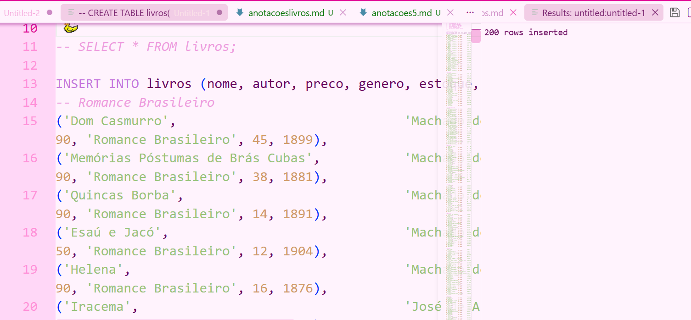

1. Exibindo todos os dados da tabela, mas limitando o resultado aos 10 primeiros registros.
````bash
SELECT * FROM livros LIMIT 10;
````
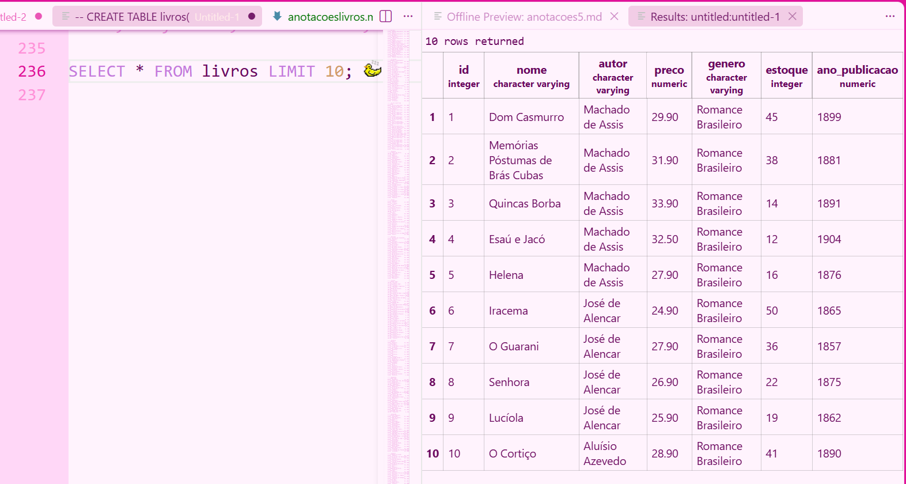

2. Exibindo apenas as colunas titulo, autor e preco de todos os livros.
````bash
SELECT nome,autor,preco FROM livros;
````
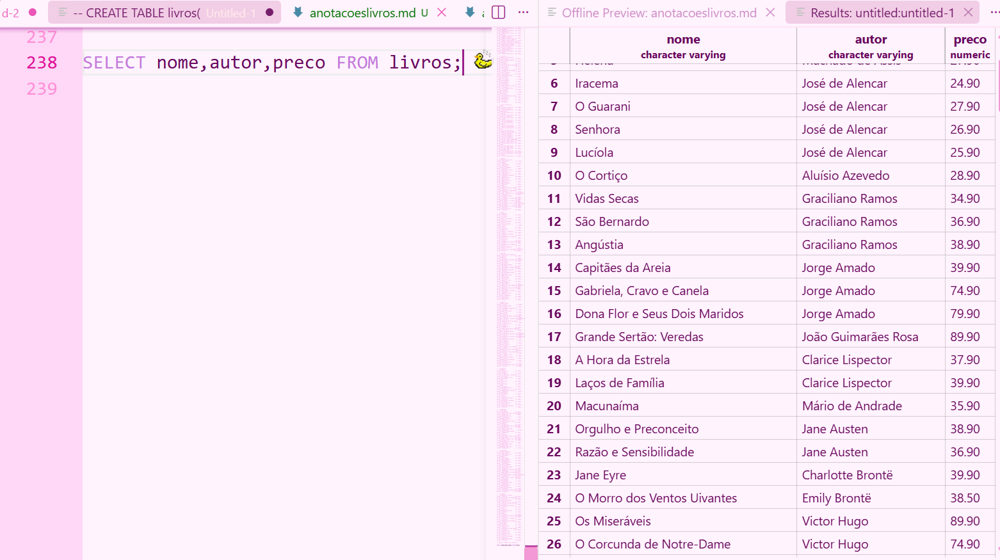

3. Listando os gêneros distintos existentes na base, em ordem alfabética.
````bash
SELECT DISTINCT genero 
FROM livros
ORDER BY genero ASC;
````
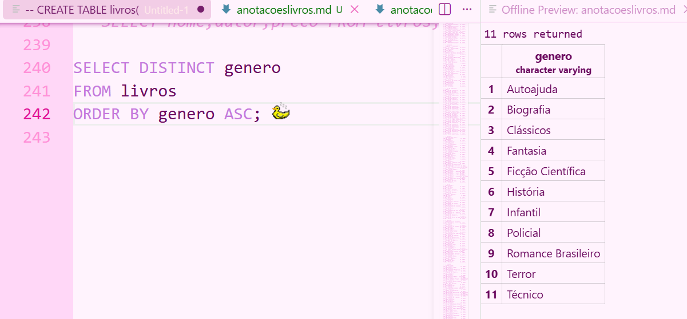

4. Descubrindo quantos autores diferentes existem.
````bash
SELECT 
    COUNT(*) AS total_livros, 
    COUNT(DISTINCT autor) AS total_autores 
FROM livros;
````
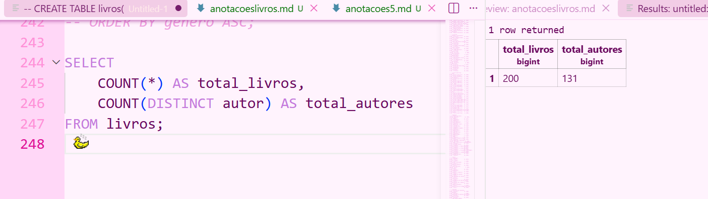

5. Listando os 5 livros mais caros da base (título e preço).
````bash
SELECT nome, preco 
FROM livros 
ORDER BY preco DESC 
LIMIT 5;
````
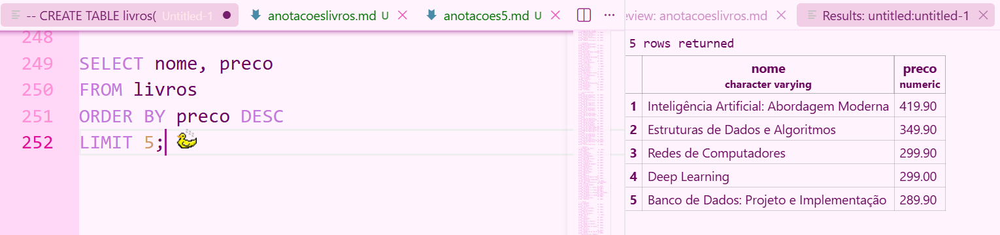

6. Listando os 5 livros com menor estoque (título e estoque).
````bash
SELECT nome, estoque 
FROM livros 
ORDER BY estoque ASC 
LIMIT 5;
````
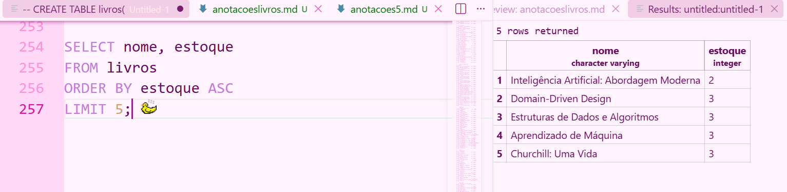

----

# Bloco 2
- Filtros numéricos


7. Mostrando titulo e estoque de todos os livros do gênero Técnico.
```bash
SELECT nome, estoque 
FROM livros
WHERE genero = 'Técnico';
````
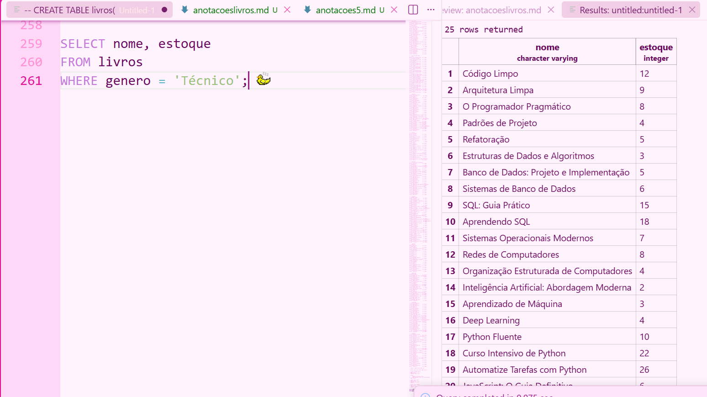

8. Mostrando titulo e preco dos livros que custam mais de R$ 200,00.
````bash
SELECT nome, preco 
FROM livros
WHERE preco > 200.00;
````
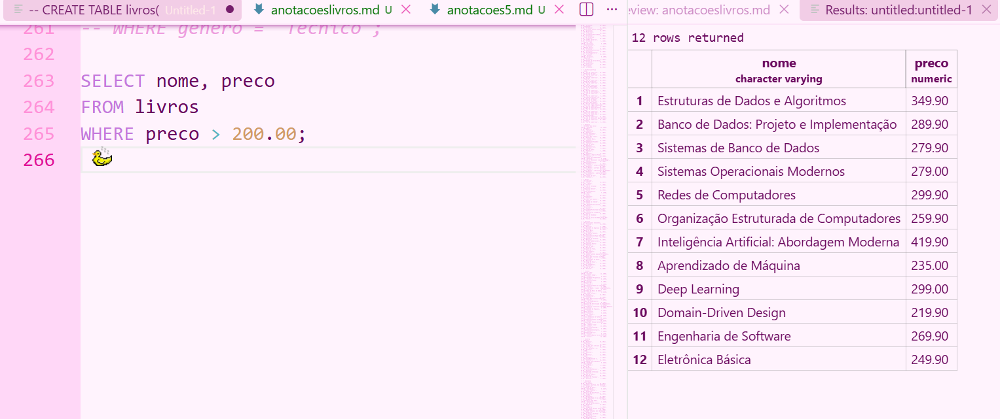

9. Mostrando titulo e preco dos livros com preço entre R$ 40,00 e R$ 70,00.
````bash
SELECT nome, preco 
FROM livros
WHERE preco BETWEEN 40.00 AND 70.00;
````
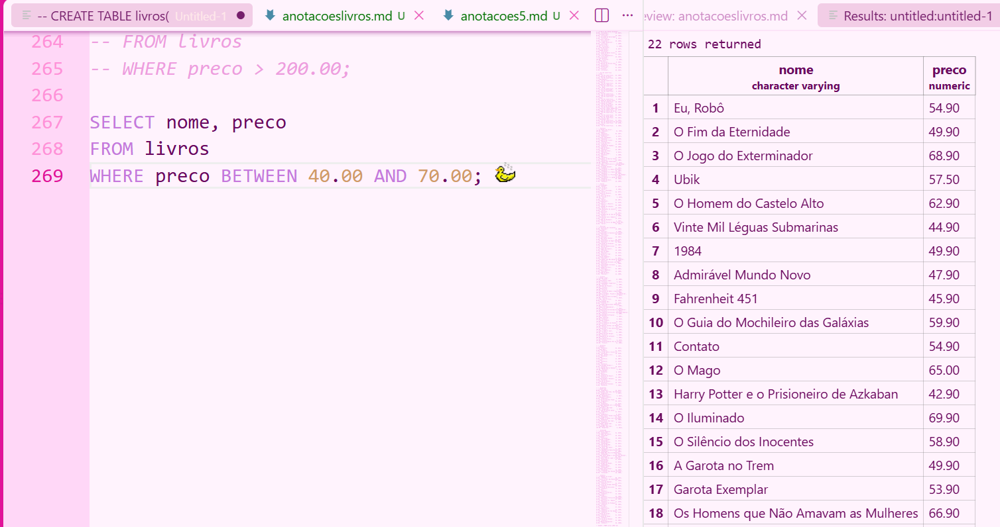

10. Mostrando os livros com estoque abaixo de 5 unidades (situação de reposição urgente).
```bash
SELECT * 
FROM livros 
WHERE estoque < 5;
```
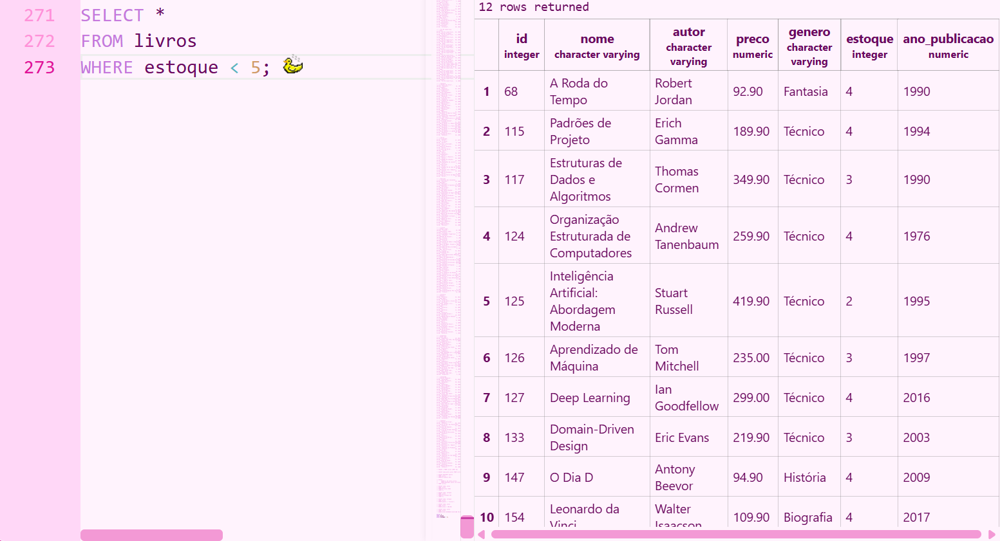

11. Listando os livros publicados antes de 1900, ordenados do mais antigo para o mais recente.
```bash
SELECT * 
FROM livros 
WHERE ano < 1900 
ORDER BY ano ASC;
````
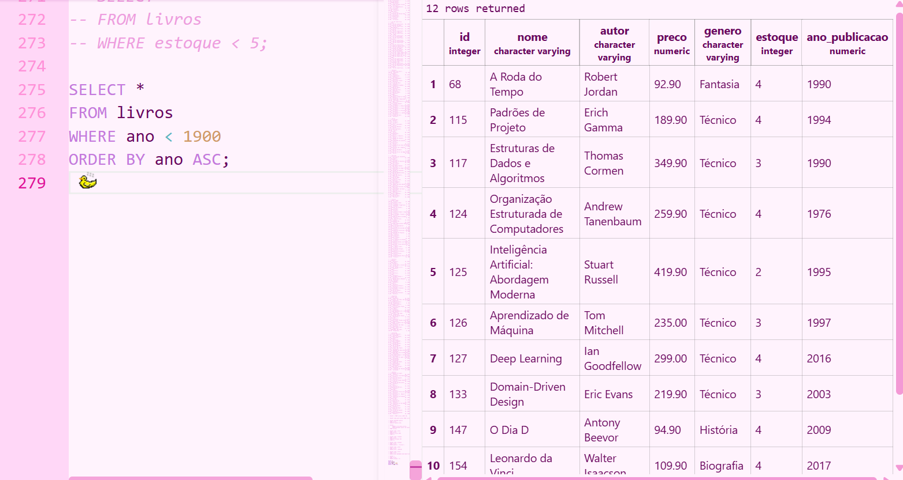

12. Listando os livros publicados entre 2010 e 2020, mostrando título, ano e gênero.
````bash
SELECT nome, ano, genero 
FROM livros 
WHERE ano BETWEEN 2010 AND 2020;
````
---
